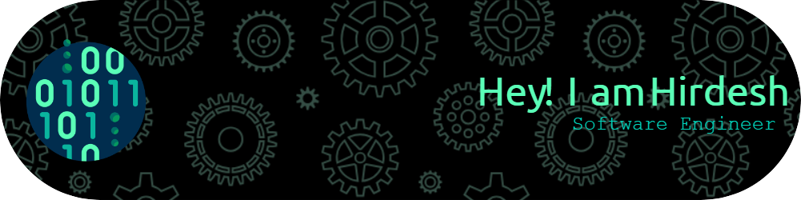

🚀 Passionate Software Engineer | AI and Cloud Enthusiast

🌐 Exploring the endless possibilities in the realm of Microsoft and Azure products. Specializing in SharePoint, React SPFx, Azure AI, and Cognitive Services.

💻 Crafting innovative solutions to elevate user experiences and streamline business processes.

🔧 Proficient in turning ideas into reality through a combination of code and creativity.

🛠️ Currently building with:

SharePoint for collaborative and efficient workflows.
React SPFX for modern, responsive, and dynamic web parts.
Unleashing the power of Azure AI and Cognitive Services for intelligent applications.
Developing Enterprise-based Native application that helps customers using MS products with Ease.

🛠️ Tools & Technologies that I Know:

🌐 Let's connect and code the future together! 👩‍💻🚀

